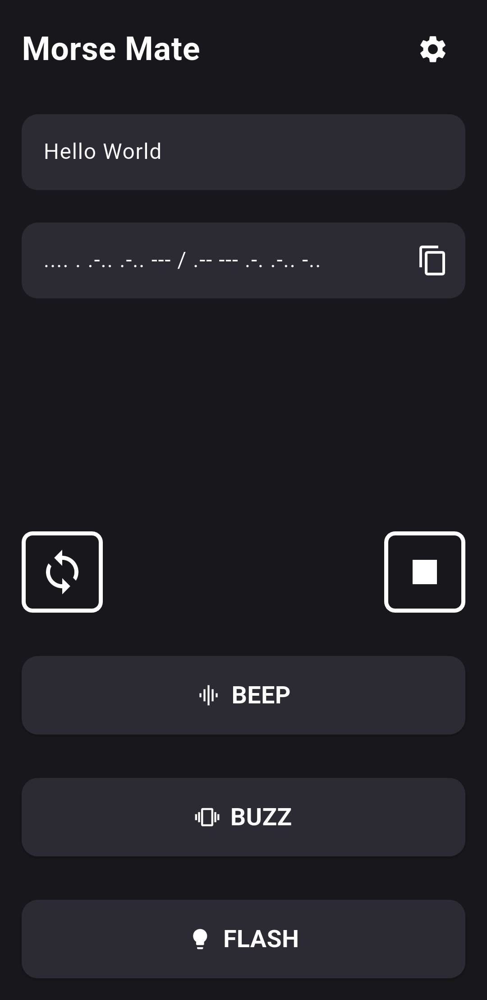
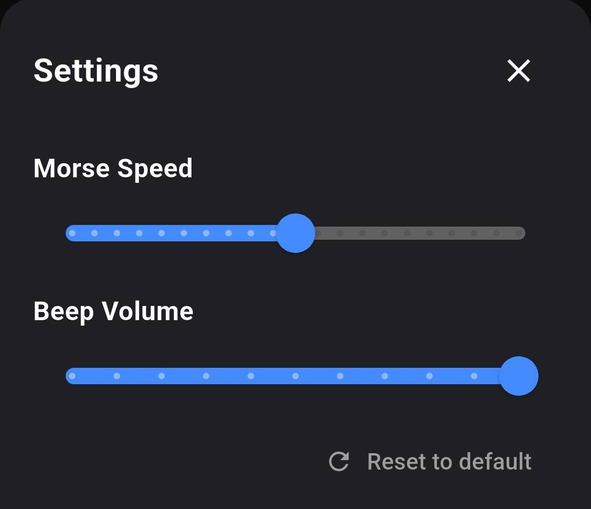

# Morse Mate

Morse Mate is a simple app developed in Flutter dedicated to the translation and display of messages in morse code.

## Features
- Text to Morse Code
- Morse Code to Text
- Beep message
- Buzz message
- Flash message
- Loop Mode
- Stop Button
- Adjustable timing parameters

## Screenshots
|  |  |
|---|---|
